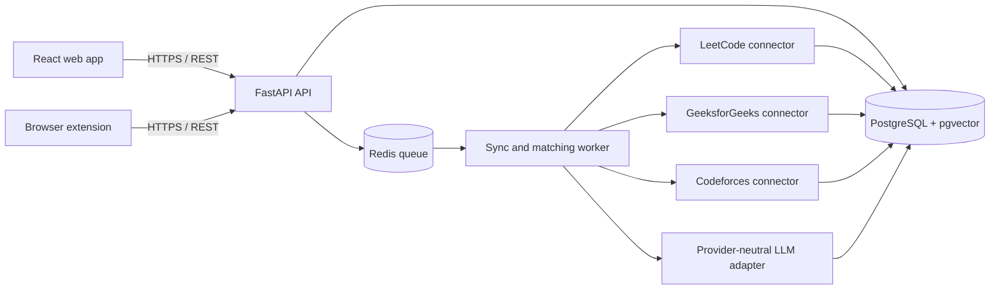

# Profligator

Profligator is a web platform that combines a candidate's public coding activity from multiple competitive-programming and interview-preparation sites into one profile. It helps candidates understand their actual breadth of practice and gives recruiters a consent-gated, read-only view of that work.

The distinguishing feature is cross-platform duplicate detection. Profligator compares problem statements and metadata, groups identical or substantially similar problems, and reports both:

- **Total problems solved** — every solved platform problem.
- **Unique problems solved** — deduplicated problem clusters that better represent breadth.

When a candidate opens a problem that resembles one already solved elsewhere, a browser extension can notify them and link to the earlier attempt.

This repository implements the product specified in the class [project report](../Group%20-%205%20.pdf). The report initially calls the concept **CodeFusion**, but the approved design, logo, GitHub repository, and later design section use **Profligator**; this implementation consistently uses Profligator.

## First-release scope

The MVP will provide:

1. Candidate registration and sign-in.
2. Public profile linking and verification.
3. LeetCode and GeeksforGeeks profile aggregation.
4. A Codeforces connector immediately after the first two connectors are stable.
5. Periodic synchronization of solved problems, difficulty, topics, activity, and contest data when the source exposes it publicly.
6. A candidate dashboard showing, in priority order:
   - total and unique problems solved;
   - topic/skill breakdown;
   - progress over time;
   - difficulty breakdown;
   - contest performance and ratings.
7. LLM-assisted cross-platform duplicate detection with a traceable link to every original problem or submission.
8. A candidate-controlled, shareable, read-only recruiter profile.
9. A browser extension that checks the currently open problem and displays a duplicate notification with a link to the previous attempt.
10. Clear partial-failure states when an external platform is unavailable or changes its public interface.

Not planned for the first release: CodeChef and HackerRank connectors, similarity scores in the user interface, automatic topic tagging, skill-gap analysis, personalized recommendations, recruiter comparison, progress prediction, and placement-platform integrations. AtCoder, Kaggle, and GitHub appear as visual suggestions in the profile-setup mock-up but are not committed MVP connectors in the SRS.

## Product rules

- Only publicly available platform data will be collected; platform passwords or private data will never be requested.
- Each connector must comply with the source platform's terms, public API policy, and rate limits.
- A recruiter can access a candidate profile only through a currently enabled candidate-approved share link.
- Duplicate matches must retain their source platform, source problem ID/URL, and earlier-attempt URL.
- A false positive is more damaging than a missed suggestion, so uncertain matches remain ungrouped or enter review rather than being presented as facts.
- The dashboard must remain useful when one connector temporarily fails; it should show data freshness and the affected connector's error state.

## User interfaces

The visual source of truth is the [Figma design](https://www.figma.com/design/eJnpqtoALXCdAu7EHcGrq1/Figma-basics?node-id=2603-1161&t=LDsIwhAnAFkB0fnI-1), supplemented by Figures 11.5–11.10 of the project report. The frontend should reproduce the designs without adding unapproved features.

Planned screens:

- Login
- Profile setup / connected accounts
- Candidate dashboard
- Profile sharing controls
- Public recruiter profile
- Browser-extension duplicate notification

## Proposed tech stack

| Area | Technology | Purpose |
| --- | --- | --- |
| Web frontend | React, TypeScript, Vite | Component-based implementation of the Figma screens with fast local builds |
| Styling | Tailwind CSS with CSS design tokens | Precise, reusable colors, spacing, type, borders, and responsive behavior |
| Routing and data | React Router, TanStack Query | Page routing, API caching, loading/error states, and refresh behavior |
| Charts | Recharts plus a small custom contribution-grid component | Dashboard activity and distribution visualizations |
| Forms and validation | React Hook Form, Zod | Typed validation for authentication, profile URLs, and sharing controls |
| Backend API | Python, FastAPI, Pydantic | Typed REST API and orchestration of connectors and matching |
| Data access | SQLAlchemy, Alembic | Relational models, queries, and versioned migrations |
| Database | PostgreSQL with `pgvector` | Users, profiles, records, clusters, sync history, and vector-assisted candidate matching |
| Collection | `httpx`, Beautiful Soup, and Playwright only where necessary | API/page retrieval, parsing, and browser rendering for permitted public data |
| Background work | Redis and RQ | Scheduled profile synchronization and matching outside web requests |
| Similarity layer | Provider-neutral LLM adapter plus embeddings | Shortlist likely matches, then evaluate supported LLM providers for accuracy, cost, and latency |
| Authentication | Short-lived JWT access tokens, rotating refresh tokens, and Argon2 password hashes | Candidate sessions and protected API access |
| Browser extension | Manifest V3, TypeScript, React | Cross-browser-oriented content script and notification UI |
| Testing | Pytest, Vitest, React Testing Library, Playwright | Unit, integration, contract, UI, and end-to-end coverage |
| Local environment | Docker Compose | Reproducible API, worker, PostgreSQL, and Redis services |
| CI | GitHub Actions | Lint, type-check, test, and build verification on real commits and pull requests |

The LLM provider is intentionally not fixed at the start. The SRS requires comparing candidate models on an agreed validation set before selecting one. Provider-specific code will sit behind a common adapter.

## Architecture



Connectors normalize source-specific records into one internal format. Raw platform records remain traceable, while the matcher groups records into unique-problem clusters. Both web views and the extension consume the same API and matching results.

## Planned repository structure

```text
Profligator/
├── apps/
│   ├── web/                 # React candidate and recruiter interfaces
│   ├── api/                 # FastAPI application and worker
│   └── extension/           # Manifest V3 browser extension
├── packages/
│   ├── ui/                  # Shared visual components and design tokens
│   └── contracts/           # Shared API schemas/types generated from OpenAPI
├── infra/
│   └── compose.yaml         # Local PostgreSQL and Redis services
├── tests/
│   ├── fixtures/            # Sanitized connector and matcher fixtures
│   └── validation/          # Labeled duplicate-detection dataset
└── .github/workflows/       # CI checks
```

The directories above are the intended structure and will be created during implementation; this documentation-only starting point does not claim they already exist.

## Delivery order

Development follows three one-week increments:

- **Week 1 — foundation and exact frontend:** scaffold the monorepo, encode the Figma design tokens, implement the documented screens with fixture data, define the schema/API contracts, and establish tests and CI.
- **Week 2 — real aggregation:** implement and validate LeetCode and GeeksforGeeks connectors, persist normalized records, run background syncs, and connect the dashboard to the API. Add Codeforces after the first two are stable.
- **Week 3 — deduplication and sharing:** evaluate matching models, build unique clusters and notifications, enforce consent-based sharing, integrate the browser extension, harden error states, and complete end-to-end acceptance tests.

The detailed technical plan and live checklist are maintained in [`../implementation.md`](../implementation.md) and [`../progress.md`](../progress.md).

## Status

Planning and repository initialization are complete. Product code has not started yet. See the [progress tracker](../progress.md) for the current state and next task.

